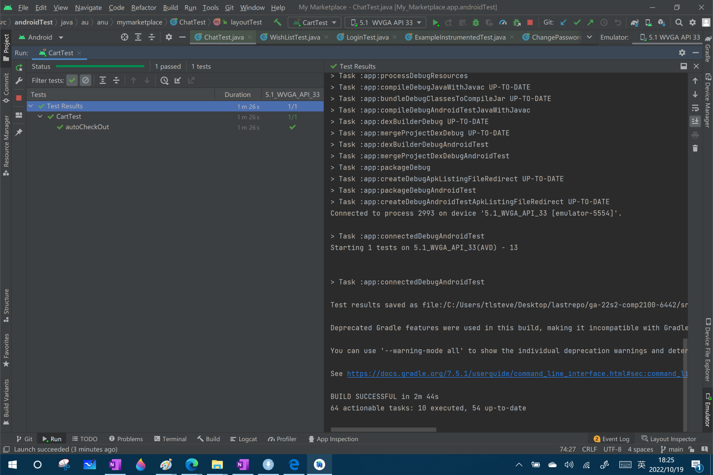

# Group Two Report

## Table of Contents

1. [Team Members and Roles](#team-members-and-roles)
2. [Summary of Individual Contributions](#summary-of-individual-contributions)
3. [Conflict Resolution Protocol](#conflict-resolution-protocol)
4. [Application Description](#application-description)
5. [Application UML](#application-uml)
6. [Application Design and Decisions](#application-design-and-decisions)
7. [Summary of Known Errors and Bugs](#summary-of-known-errors-and-bugs)
8. [Testing Summary](#testing-summary)
9. [Implemented Features](#implemented-features)
10. [Team Meetings](#team-meetings)

## Team Members and Roles

| UID      |      Name      |          Role |
|:---------|:--------------:|--------------:|
| u7394442 |   Zeyu Zhang   | Product Owner |
| u7424738 |  Weiqiang Pu   |     Developer |
| u7443132 | Chunkun Ouyang |     Developer |
| u7338864 |  Songshen Xie  |      Reviewer |

## Summary of Individual Contributions

- *UID: 7443132, Name: Chunkun Ouyang, I contribute 25% of the code. Here are my contributions:*
  1. [MessageAdapter](../src/app/src/main/java/au/anu/mymarketplace/UI/MessageAdapter.java) class
  2. [MessageBean](../src/app/src/main/java/au/anu/mymarketplace/UI/MessageBean.java) class
  3. [MessageActivity](../src/app/src/main/java/au/anu/mymarketplace/UI/MessageActivity.java) class
  4. [AccountInfo](../src/app/src/main/java/au/anu/mymarketplace/UI/AccountInfo.java) class
  5. [MessageFragment](../src/app/src/main/java/au/anu/mymarketplace/UI/fragments/MessageFragment.java) class
  6. Collaborate with Zeyu Zhang to complete the implement of back-end program of [sorting items (line 215-322)](https://gitlab.cecs.anu.edu.au/u7394442/ga-22s2-comp2100-6442/-/blob/main/src/app/src/main/java/au/anu/mymarketplace/UI/fragments/SearchFragment.java), searching via [Red Black Tree (line 358-384) ](https://gitlab.cecs.anu.edu.au/u7394442/ga-22s2-comp2100-6442/-/blob/main/src/app/src/main/java/au/anu/mymarketplace/RedBlackTree.java) and corresponding [unit test](https://gitlab.cecs.anu.edu.au/u7394442/ga-22s2-comp2100-6442/-/blob/main/src/app/src/test/java/au/anu/mymarketplace/SortAndSearchTest.java).
  7. Zeyu and Chukun jointly produced 3000 pieces of metadata used by the app.
  8. generate Json with zhang using java IO.
- *UID: 7338864, Name: Songshen Xie, I contribute 25% of the code. Here are my contributions:*
  1. [CartAdapter](../src/app/src/main/java/au/anu/mymarketplace/UI/CartAdapter.java) class
  2. Implement [cart](../src/app/src/main/java/au/anu/mymarketplace/UI/fragments/CartFragment.java) feature and design corresponding interface  [fragment_cart](../src/app/src/main/res/layout/fragment_cart.xml) and [item_cart](../src/app/src/main/res/layout/item_cart.xml)
  3. Implement sorting filter,  [Ascendent and Descendent](https://gitlab.cecs.anu.edu.au/u7394442/ga-22s2-comp2100-6442/-/blob/main/src/app/src/main/java/au/anu/mymarketplace/UI/fragments/SearchFragment.java#L72-99), in the [SearchFragment.java](../src/app/src/main/java/au/anu/mymarketplace/UI/fragments/SearchFragment.java)
  4. Apply [Red-and-Black Tree](../src/app/src/main/java/au/anu/mymarketplace/RedBlackTree.java) to return a [surprising item](https://gitlab.cecs.anu.edu.au/u7394442/ga-22s2-comp2100-6442/-/blob/main/src/app/src/main/java/au/anu/mymarketplace/UI/fragments/SearchFragment.java#L101-119) of which price most close to user wanted
- *UID: 7424738, Name: Weiqiang Pu, I contribute 25% of the code. Here are my contributions:*
  1. [RedBlackTree](../src/app/src/main/java/au/anu/mymarketplace/RedBlackTree.java) class and [RedBlackTreeTest](../src/app/src/test/java/au/anu/mymarketplace/RedBlackTreeTest.java) class.
  2. [LoginActivity](../src/app/src/main/java/au/anu/mymarketplace/UI/LoginActivity.java) class and use Firebase to implement user Authentication and register new users.
  3. Design grammar and write the contents of the [parser](../src/app/src/main/java/au/anu/mymarketplace/parser) folder.
  4. Implement [search](../src/app/src/main/java/au/anu/mymarketplace/UI/fragments/SearchFragment.java) feature and design [corresponding interface](../src/app/src/main/res/layout/fragment_search.xml).
  5. Apply three design patterns.([DAO](../src/app/src/main/java/au/anu/mymarketplace/DAO), singleton, [factory](../src/app/src/main/java/au/anu/mymarketplace/factory/DaoFactory.java))
  6. Add [Wishlist](../src/app/src/main/java/au/anu/mymarketplace/UI/WishlistActivity.java) and [ChangePassword](../src/app/src/main/java/au/anu/mymarketplace/UI/ChangePasswordActivity.java) to improve user experience.
  7. Design the [UI](../src/app/src/main/res/navigation/mobile_navigation.xml) and [code](../src/app/src/main/java/au/anu/mymarketplace/UI/MainActivity.java) of the bottom navigation bar.
- *UID: 7394442, Name: Zeyu Zhang, I contribute 25% of the code. Here are my contributions:*
  1. Generate [Json Configuration](https://gitlab.cecs.anu.edu.au/u7394442/ga-22s2-comp2100-6442/-/blob/main/IO/ReadFile.java) via Java I/O for semi-structured inputs.
  2. Design and implement UI Test of layout and functional correctness of [Login Interface](https://gitlab.cecs.anu.edu.au/u7394442/ga-22s2-comp2100-6442/-/blob/main/src/app/src/androidTest/java/au/anu/mymarketplace/LoginTest.java) via Espresso, simulate the user's register and login operation.
  3. Design and implement UI Test of layout and function of [Search Interface](https://gitlab.cecs.anu.edu.au/u7394442/ga-22s2-comp2100-6442/-/blob/main/src/app/src/androidTest/java/au/anu/mymarketplace/SearchTest.java) via Espresso, simulate the operation of searching.
  4. Testing the UI layout of [Message Interface](https://gitlab.cecs.anu.edu.au/u7394442/ga-22s2-comp2100-6442/-/blob/main/src/app/src/androidTest/java/au/anu/mymarketplace/ChatTest.java) via Espresso.
  5. Testing the [shopping cart](https://gitlab.cecs.anu.edu.au/u7394442/ga-22s2-comp2100-6442/-/blob/main/src/app/src/androidTest/java/au/anu/mymarketplace/CartTest.java) UI and function via Espresso simulations.
  6. Design the UI test for [Add To Wishlist](https://gitlab.cecs.anu.edu.au/u7394442/ga-22s2-comp2100-6442/-/blob/main/src/app/src/androidTest/java/au/anu/mymarketplace/WishListTest.java) and simulate the operation via Espresso.
  7. Testing the layout and function of [Changing Password](https://gitlab.cecs.anu.edu.au/u7394442/ga-22s2-comp2100-6442/-/blob/main/src/app/src/androidTest/java/au/anu/mymarketplace/ChangePasswordTest.java).
  8. Collaborate with Chukun Ouyang to complete the implement of back-end program of [sorting items (line 215-322)](https://gitlab.cecs.anu.edu.au/u7394442/ga-22s2-comp2100-6442/-/blob/main/src/app/src/main/java/au/anu/mymarketplace/UI/fragments/SearchFragment.java), searching via [Red Black Tree (line 358-384) ](https://gitlab.cecs.anu.edu.au/u7394442/ga-22s2-comp2100-6442/-/blob/main/src/app/src/main/java/au/anu/mymarketplace/RedBlackTree.java) and corresponding [unit test](https://gitlab.cecs.anu.edu.au/u7394442/ga-22s2-comp2100-6442/-/blob/main/src/app/src/test/java/au/anu/mymarketplace/SortAndSearchTest.java).

  
*[Code Design. What design patterns, data structures, did the involved member propose?]* 
Weiqiang applies all three design patterns. 
Weiqiang compiles RedBlack tree structure, while Zeyu and Chukun apply it. 
*[UI Design. Specify what design did the involved member propose? What tools were used for the design?]* 
Weiqiang designs [Login](../src/app/src/main/res/layout/activity_login.xml), [main](../src/app/src/main/res/layout/activity_main.xml), [search](../src/app/src/main/res/layout/fragment_search.xml), [profile](../src/app/src/main/res/layout/fragment_profile.xml), [item details](../src/app/src/main/res/layout/activity_item_details.xml), [change password](../src/app/src/main/res/layout/activity_change_password.xml), [wishlist](../src/app/src/main/res/layout/activity_wishlist.xml). 
Chunkun designs [message](../src/app/src/main/res/layout/fragment_message.xml) and [chat](../src/app/src/main/res/layout/activity_chat.xml).
Songshen designs [cart](../src/app/src/main/res/layout/fragment_cart.xml) and [search](../src/app/src/main/res/layout/fragment_search.xml). 
*[Report Writing. Which part of the report did the involved member write?]* 
All members should write two parts: individual contributions and implementation features. 
Weiqiang also completes [Conflict Resolution Protocol](#conflict-resolution-protocol),[Application Description](#application-description), [Application UML](#application-uml) and [Testing Summary](#testing-summary) chapters alone. 
Weiqiang and Zeyu jointly complete the [Application Design and Decisions](#application-design-and-decisions) and [Testing Summary](#testing-summary) chapters 
*[Slide preparation. Were you responsible for the slides?]* 
Weiqiang prepares the slides, Zeyu makes the presentation.
*[Miscellaneous contributions. You are welcome to provide anything that you consider as a contribution to the project or team.]* 
Zeyu and Chukun jointly produced 3000 pieces of metadata used by the app. They spent a lot of time. 

## Conflict Resolution Protocol

Use the following protocols to handle concerns before they turn into conflicts. Follow the protocols until an answer or resolution to a problem or concern has been reached.
#### Protocol 1. If one has disagreements with other's decisions or views. ####
1. Air and discuss the concern.
2. Hold the meeting to a discussion of the concern and its possible resolutions.
3. Make the meeting time convenient for both parties.
4. Keep the meeting room open or have at least one or more other person.
5. Maintain respect on both sides throughout the discussion.
6. If closure of the issue was not reached, or if a party is not satisfied with the results, then voting will be adopted.
7. Use the meeting to bring closure to the concern.
#### Protocol 2. If one fails to complete his/her job on time. ####
1. Understand the reasons why the member did not complete on time.
2. Analyze the cause.
3. Hold the meeting to a discussion of the concern and its possible resolutions. *For example, whether the member can be trained to complete the task, or whether other member can take over the task of the member.*
4. Update the schedule and responsibility breakdown matrix.
5. Have a supervisor to supervise the work.
#### Protocol 3. If one cannot continue to work due to force majeure. ####
1. Identify and prioritize the remaining work of the member.
2. Analyze the current development progress and schedule.
3. Hold the meeting to a discussion of the concern and its possible resolutions.
4. Update the schedule and responsibility breakdown matrix.

## Application Description

*[What is your application, what does it do? Include photos or diagrams if necessary]*

First of all,users need to log in to the app. If there is no account, they can register.

The search page is displayed by default after login.

The user can enter the product name in the search box or search according to the grammar, and then the page will display the corresponding product.

When the search results appear, you can select ascending or descending order。

Click the goods shown in the page will jump to the product details page. In this page, the product image, name, seller, rating, sales volume, stock, description and price will display in detail. Users can click the icon next the product name to add the product to the wishlist, or directly click the button below to add the product to the shopping cart.

Click the navigation bar below the main page to enter the cart page. In the cart, users can select goods and check out.

Our software also provides P2P message function. Users can send messages to sellers for communication.

On the profile page, users can view their wishlist or change password.

**Application Use Cases and or Examples**

*Targets Users: residents living in remote areas*
* *Users can use it to purchase goods across geographical restrictions.*
* *Users can enjoy home delivery without having to leave home.*
* *Users can save the time of shopping in the mall.*
* *Users can add items into wishlist to find the items more quickly in the future.*
* *Users can sort the search results in ascending or descending order.*

*Target Users: sellers*
* *Users can expand their sales channel.*
* *Users can save physical business costs.*
* *Users can sell goods without geographical restrictions.*

## Application UML

  

## Application Design and Decisions

*Please give clear and concise descriptions for each subsections of this part. It would be better to list all the concrete items for each subsection and give no more than `5` concise, crucial reasons of your design. Here is an example for the subsection `Data Structures`:*

**Data Structures**

1. *Red-black Tree*

   * *Objective: It is used to store search results for filtering*

   * *Locations: line 102 - 119 in [SearchFragment](../src/app/src/main/java/au/anu/mymarketplace/UI/fragments/SearchFragment.java).*

   * *Reasons:*

     * *It is more efficient than BST and AVL tree for insertion and search with a time complexity log(n)* 
     * *We don't need to access the item by index for this feature*
     * *Using a binary search tree, for example, may make the tree too tall. This is a negative factor for search efficiency.*

2. *ArrayList*

   * *Objective: It is used to store search results for view*

   * *Locations: line 67 in [SearchFragment](../src/app/src/main/java/au/anu/mymarketplace/UI/fragments/SearchFragment.java).*

   * *Reasons:*

     * *Default data structure of adapter* 

**Design Patterns**

*We use three design patterns: Singleton, Factory and DAO. The [DAO](../src/app/src/main/java/au/anu/mymarketplace/DAO) provides a unified data interface. The singleton pattern ensures that there is only one data interface. The [factory](../src/app/src/main/java/au/anu/mymarketplace/factory/DaoFactory.java) pattern reduces the coupling between the interface and the program.*

**Grammar(s)**

Query Rules:
    
A valid query contains at least 1 command. Different commands are distinguished by symbol ";", all commands are case-insensitive.
For example:
1. ASUS high performance; 2. $300; 3. type = computer; 4. seller = JD; 5. rating = 5; 6. intext = low cost
This example is searching an item which name contains "ASUS high performance"(case-insensitive), price is 300, type is computer, seller is JD and rating is 5.

No declaration means name fuzzy match. All items with the searched value in their name will be retrieved.
Example: Silent full-automatic washing machine
"$" means searching for a specified price
Example: $329
"Seller" means searching for a specified seller.
Example: Seller = Amazon
"intext" means searching for items containing a certain word somewhere in the description.
Example: intext = "High performance" + "Automatic cleaning function"
"tag" means searching for items with a specified type.
Example: type = mobile phone
"rating" means searching for items with a specified rating.
Example: rating = 5
 

the grammar rules:

    <expression> ::= <command> ; <expression>

*[How do you design the grammar? What are the advantages of your designs?]*

we design our search grammar according to search engine rules. Both exact match and fuzzy match are supported. We also support advanced search while satisfying users' general search needs.

**Tokenizer and Parsers**

We use tokenizer to identify and classify the search content and generate the corresponding data type through the parser to search.

**Other**

We use Firebase to perform user authentication. Two marker accounts(as shown below) have been created in advance for accessing services.  
    Username: comp2100@anu.au   Password: comp2100
    Username: comp6442@anu.au   Password: comp6442
Of course, you can also create new accounts freely if you want.

We also user Firebase realtime database to store data. `comp21006442@gmail.com` has been added as an Observer. Click [here to our Firebase project](https://console.firebase.google.com/project/ga-22s2-comp6442/overview).

## Summary of Known Errors and Bugs

1. *Bug 1:*
- The [Tokenizer](../src/app/src/main/java/au/anu/mymarketplace/parser/Tokenizer.java) has limited functionality. If uppercase letters are mixed in the string, it cannot be recognized. 
- *Since product name are decided by the manufacturers, the lack of unified naming standards and norms, leading to different product names varying greatly. Case, special characters and even other languages may appear in the product name. This brings a lot of trouble to the search recognition. We tried to use the rules of search engines, such as Google, to formulate our search grammar. However, due to the limitation of strength and time, we can only implement the basic functions*

2. *Bug 2:*
- The [ItemDaoImp](../src/app/src/main/java/au/anu/mymarketplace/DAO/ItemDaoImp.java) cannot return data synchronously. 
- *Because the Firebase data is processed asynchronously, the View cannot obtain the data while using the DAO, which causes that the view needs to be refreshed again.* 

3. *Bug 3:*
- If there are too many items in the shopping cart or wishlist, the program will crash.
- Because each good will create a new object, too many product objects will greatly consume resources.

4. *Bug 4:*
- The chat blacklisting feature is seriously flawed due to a previous design issue.
- I made a blacklist storage space in Firebase, but did not consider blocking the other user, the other user can still chat with the current user, the algorithm failed.

## Testing Summary

1. [RedBlackTreeTest](../src/app/src/test/java/au/anu/mymarketplace/RedBlackTreeTest.java)

- *Number of test cases: 19*

- *Code coverage: 100%*

- *Types of tests created: line coverage*

2. [TokenizerTest](../src/app/src/test/java/au/anu/mymarketplace/TokenizerTest.java)

- *Number of test cases: 4*

- *Code coverage: 100%*

- *Types of tests created: line coverage*
  

3. [ParserTest](../src/app/src/test/java/au/anu/mymarketplace/ParserTest.java)
- *Number of test cases: 4*

- *Code coverage: 81%*

- *Types of tests created: line coverage*
  

  4. [SortAndSearchTest](https://gitlab.cecs.anu.edu.au/u7394442/ga-22s2-comp2100-6442/-/blob/main/src/app/src/test/java/au/anu/mymarketplace/SortAndSearchTest.java)
- *Number of test cases: 1*

- *Code coverage: 100%*

- *Types of tests created: line coverage*
  

  5. [LoginTest](https://gitlab.cecs.anu.edu.au/u7394442/ga-22s2-comp2100-6442/-/blob/main/src/app/src/androidTest/java/au/anu/mymarketplace/LoginTest.java)
- *Number of test cases: 6*

- *Code coverage: 100%*

- *Types of tests created: Android Test (UI)*
  

  6. [ChangePasswordTest](https://gitlab.cecs.anu.edu.au/u7394442/ga-22s2-comp2100-6442/-/blob/main/src/app/src/androidTest/java/au/anu/mymarketplace/ChangePasswordTest.java)
- *Number of test cases: 9*

- *Code coverage: 100%*

- *Types of tests created: Android Test (UI)*
  

  7. [ChatTest](https://gitlab.cecs.anu.edu.au/u7394442/ga-22s2-comp2100-6442/-/blob/main/src/app/src/androidTest/java/au/anu/mymarketplace/ChatTest.java)
- *Number of test cases: 1*

- *Code coverage: 80%*

- *Types of tests created: Android Test (UI)*
  

  8. [WishListTest](https://gitlab.cecs.anu.edu.au/u7394442/ga-22s2-comp2100-6442/-/blob/main/src/app/src/androidTest/java/au/anu/mymarketplace/WishListTest.java)
- *Number of test cases: 1*

- *Code coverage: 100%*

- *Types of tests created: Android Test (UI)*
  

  9. [CartTest](https://gitlab.cecs.anu.edu.au/u7394442/ga-22s2-comp2100-6442/-/blob/main/src/app/src/androidTest/java/au/anu/mymarketplace/CartTest.java)
- *Number of test cases: 1*

- *Code coverage: 100%*

- *Types of tests created: Android Test (UI)*
  

  10. [SearchTest](https://gitlab.cecs.anu.edu.au/u7394442/ga-22s2-comp2100-6442/-/blob/main/src/app/src/androidTest/java/au/anu/mymarketplace/SearchTest.java)
- *Number of test cases: 1*

- *Code coverage: 90%*

- *Types of tests created: Android Test (UI)*
  

## Implemented Features

Feature Category: Greater Data Usage, Handling and Sophistication  
*Implemented features:*
1. Feature 1: **Deletion method for Red-Black Tree (hard)**
   * Class [RedBlackTree](../src/app/src/main/java/au/anu/mymarketplace/RedBlackTree.java), methods `delete()`, Lines of code: 164-210
   * Description: when a node is removed from the RBTree, the RBTree needs to be adjusted. This is the hard part of this feature.
2. Feature 2: **User profile activity containing a media file (image, animation (e.g. gif), video).(easy)**
    * Class [ProfileFragment](../src/app/src/main/res/layout/fragment_profile.xml), lines of code: 16 - 24.
    * Description: a default image will be displayed in the profile activity.
 

Feature Category: Firebase Integration  
*Implemented features:* 
1. Feature 1: **Use Firebase to implement user Authentication/Authorisation. (easy)**
   * Class [LoginActivity](../src/app/src/main/java/au/anu/mymarketplace/UI/LoginActivity.java): methods `checkLogin()`, `register()`, lines of code: 87 - 139
   * Description: Firebase has a ready-made authentication solution.
2. Feature 2: **Use Firebase to persist all data used in our app. (medium)**
   * Description: all data is stored in the Firebase Realtime database.
3. Feature 3: **Using Firebase or another remote database to store user information and having the app updated as the remote database is updated without restarting the application. E.g. User A makes a transfer, user B on a separate instance of the application sees user A’s transfer appear on their app instance without restarting their application. (very hard)**
   * Class [SearchFragment](../src/app/src/main/java/au/anu/mymarketplace/UI/fragments/SearchFragment.java): methods `search()`, lines of code: 72 - 113. Class [MessageActivity](../src/app/src/main/java/au/anu/mymarketplace/UI/MessageActivity.java): methods `initData()`, lines of code: 107 - 147. Class [WishlistActivity](../src/app/src/main/java/au/anu/mymarketplace/UI/WishlistActivity.java): methods `getWishlist()`, lines of code: 57 - 78.
   * Description: we use `addValueEventListener()` to read data and listen for changes. Once the data in the database changes, the local data will be updated automatically.
 
   
Feature Category: Resource Management  
*Implemented features:* 
1. Feature 1: **Log transfers. For transparency, all transfers may be logged and reported (textually or graphically).(medium)**
   * Class [ChangePasswordActivity](../src/app/src/main/java/au/anu/mymarketplace/UI/ChangePasswordActivity.java): methods `confirm()`, lines of code: 54 - 81. Class [LoginActivity](../src/app/src/main/java/au/anu/mymarketplace/UI/LoginActivity.java): methods `checkLogin()`, `register()`, lines of code: 87 - 139
   * Description: Key transactions are all recorded in the log.
 

Feature Category: Search-related features  
*Implemented features:*
1. Feature 1: **Search functionality can handle partially valid and invalid search queries. (medium)**
   * Class [Tokenizer](../src/app/src/main/java/au/anu/mymarketplace/parser/Tokenizer.java), [Parser](../src/app/src/main/java/au/anu/mymarketplace/parser/Parser.java)
   * Description: Tokenizer and parser are used to check whether the input string is valid or not.
2. Feature 2: **Sort a list of products returned from a search based on price, popularity, rating, availability, etc. (easy)**
   * Class [ChangePasswordActivity](https://gitlab.cecs.anu.edu.au/u7394442/ga-22s2-comp2100-6442/-/blob/main/src/app/src/main/java/au/anu/mymarketplace/UI/fragments/SearchFragment.java): methods `sortAscent()`, lines of code: 231 - 277, methods `sortDescent()`, lines of code: 279 - 322.
   * Description: These methods could sort the item by their prices.
 

Feature Category: User Interactivity  
*Implemented features:*
1. Feature 1: **The ability to micro-interact with items in your app (e.g. add to watchlist/add to cart/like an item/report an item/add reviews (stars)). (easy)**
    * Class [ItemDetailsActivity](../src/app/src/main/java/au/anu/mymarketplace/UI/ItemDetailsActivity.java): methods `addCart()`, lines of code: 74 - 97. methods `addWishlist()`, lines of code: 104 - 127.
 

Feature Category: Peer to Peer Messaging  
*Implemented features:*
1. Feature 1: **Provide users with the ability to message each other directly. (hard)**
    * Class [MessageActivity](../src/app/src/main/java/au/anu/mymarketplace/UI/MessageActivity.java).
       

Feature Category: UI Design and Testing  
*Implemented features:*
1. Feature 1: **UI tests using espresso or similar. Please note that your tests must be of reasonable quality. (hard)**
    * Class [CartTest](https://gitlab.cecs.anu.edu.au/u7394442/ga-22s2-comp2100-6442/-/blob/main/src/app/src/androidTest/java/au/anu/mymarketplace/CartTest.java): The Whole Class,
      Class [ChangePasswordTest](https://gitlab.cecs.anu.edu.au/u7394442/ga-22s2-comp2100-6442/-/blob/main/src/app/src/androidTest/java/au/anu/mymarketplace/ChangePasswordTest.java): The Whole Class,
      Class [ChatTest](https://gitlab.cecs.anu.edu.au/u7394442/ga-22s2-comp2100-6442/-/blob/main/src/app/src/androidTest/java/au/anu/mymarketplace/ChatTest.java): The Whole Class,
      Class [LoginTest](https://gitlab.cecs.anu.edu.au/u7394442/ga-22s2-comp2100-6442/-/blob/main/src/app/src/androidTest/java/au/anu/mymarketplace/LoginTest.java): The Whole Class,
      Class [SearchTest](https://gitlab.cecs.anu.edu.au/u7394442/ga-22s2-comp2100-6442/-/blob/main/src/app/src/androidTest/java/au/anu/mymarketplace/SearchTest.java): The Whole Class,
      Class [WishListTest](https://gitlab.cecs.anu.edu.au/u7394442/ga-22s2-comp2100-6442/-/blob/main/src/app/src/androidTest/java/au/anu/mymarketplace/WishListTest.java): The Whole Class
    * Description: These are UI tests via Espresso

## Team Meetings

- *[Team Meeting 1](./meeting minutes/meeting1.md)*
- *[Team Meeting 2](./meeting minutes/meeting2.md)*
- *[Team Meeting 3](./meeting minutes/meeting3.md)*
- *[Team Meeting 4](./meeting minutes/meeting4.md)*
- *[Team Meeting 5](./meeting minutes/meeting5.md)*
